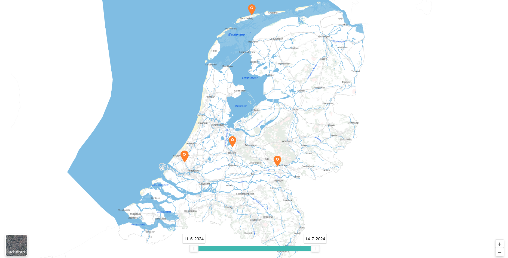

# Fotoviewer
Fotoviewer ter ondersteuning bij wateroverlast en overstroming-situaties

Inhoudsopgave
- [Runnen fotoviewer](#runnen-fotoviewer)
- [Python installatie](#python-installatie)
- [Mails-processen](#mails-processen)

De fotoviewer is gemaakt door [D2Hydro](https://d2hydro.nl/) samen met [Rijkswaterstaat](https://www.rijkswaterstaat.nl/) en [Waterschap Amstel Gooi en Vecht](https://www.agv.nl/)

## Runnen fotoviewer
Download de fotoviewer uit de release: [fotoviewer](https://github.com/d2hydro/fotoviewer/releases/latest/download/fotoviewer.zip). Deze bevat de volgende inhoud:

```
├──app
│   ├── static
│   │   ├── data
│   │   │   ├── image1.jpg
│   │   │   ├── image2.png
│   │   │   ├── imagex.jpg
│   │   │   └── ....
│   │   └── js
│   │       ├── fotos.js
│   │       └── ...
│   └── index.html
└──scripts
    ├── parse_inbox.py
    ├── read_mailbox.py
    └── update_app.py
```

De app werkt uit-de-box door op `app\index.html` te klikken:



Let op (!), voor het processen van mails (zie: [Mails-processen](#mails-processen)) is het belangrijk dat het mapje `scripts` op gelijke hoogte blijft staan met het mapje `app`, zoals het geval is in fotoviewer.zip. 

## Python installatie
Voor het processen van e-mails gebruiken we Python. 

Maak een `Anaconda` environment met [environment.yml](python/environment.yml), zie [Anaconda docs](https://conda.io/projects/conda/en/latest/user-guide/tasks/manage-environments.html#creating-an-environment-from-an-environment-yml-file) voor uitleg.

## Mails processen

### Data-folder
Alle mails worden verwerkt met een datastructuur hieronder weergegeven in `app_dir`:
- `inbox` bevat alle emails handmatig, of automatisch, gedownload uit een mailbox en opgeslagen als email-file (eml)
- `datastore` bevat alle foto's in uit de bijlagen van de emails en de meta-data, onderwerp en inhoud van de emails opgeslagen in `fotos.gpkg` (GeoPackage)
- `archive` mails die zijn geparsed van `inbox` naar `datastore` worden opgeslagen in `archive`.

```
data_dir
├── archive
│   └── YYYYMMDDThhmmss_archived_eml_file.eml
├── datastore
│       ├── fotos.gpkg
│       ├── image1.jpg
│       ├── image2.png
│       └── imagex.jpg
└── inbox
        └── eml_file.eml
```

### Versturen e-mails
Voor het versturen van foto's per e-mail is het is het belangrijk dat:
- Foto's zijn voorzien zijn van gps-tags in [exif](https://en.wikipedia.org/wiki/Exif). Check of deze aan staat voor uw telefoon! Dit is te controleren door uw foto te slepen in deze webapplicatie: https://tool.geoimgr.com/
- De exif-metadata niet wordt verwijderd door uw mail-client (!)
- U bewust bent dat het `onderwerp` en de `inhoud` van de mail ook in de fotoviewer zichtbaar zullen zijn (discretie geadviseerd).

### lezen-mails
E-mails dienen te worden opgeslagen in een lokale `inbox` sub-folder in de [data folder](#data-folder). Als alternatief is het ook mogelijk emails automatisch uit te lezen met een script, zie: [read_mailbox.py](scripts/read_mailbox.py). 

### processen inbox
In deze stap wordt vanuit de `inbox` data verplaatst in de [data folder](#data-folder):
1. Worden emls gelezen uit `inbox`
2. Foto's en metadata (in `fotos.gpkg`) opgeslagen in `datastore`
3. Eml's verplaatst van `inbox` naar `archive`
Dit wordt uitgevoerd met [parse_inbox.py](scripts/parse_inbox.py)

### update_app
In deze stap wordt vanuit `datastore` de [fotoviewer](#runnen-fotoviewer) geupdated. De fotos komen in `app/static/data` te staan en de meta-data in `app/static/js/fotos.js`. Dit wordt uitgevoerd met [update_app.py](scripts/update_app.py)

### windows environment variables
In de scripts wordt verwezen naar `app_dir` (`inbox` en `datastore`), `email_address` en `password`. U hoeft deze variabelen niet in de script te zetten, wanneer u in uw Windows omgevingsvariabelen (environment variables) de volgende variabelen opneemt:
- `FOTOVIEWER_ADDRESS`: het email-adres (`email_adress`)
- `FOTOVIEWER_DATA_DIR`: de `data_dir`, zie [Data folder](#data-folder). Ook `inbox` en `datastore` worden hieruit afgeleid.
- `FOTOVIEWER_PASS`: het password van uw email-adres.